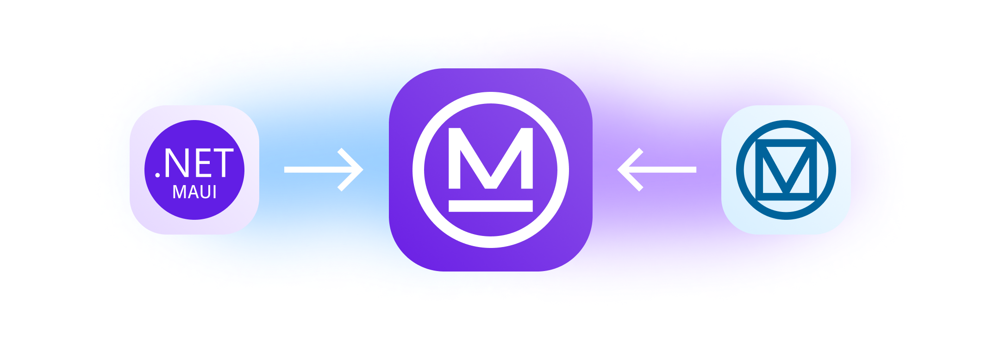

# MaterialDesignControls Plugin for .NET MAUI <!-- omit from toc -->

<p align="center">
    
</p>

MaterialDesignControls for .NET MAUI, provides a collection of UI controls that follow [Material Design 3 Guidelines](https://m3.material.io/).

## Content table <!-- omit from toc -->
- [Demo](#demo)
- [Platform support](#platform-support)
- [Setup](#setup)
- [Getting started](#getting-started)
- [Controls](#controls)
  - [Coming soon](#coming-soon)
- [Styles](#styles)
- [Configurations](#configurations)
  - [Configuration by code](#configuration-by-code)
    - [Themes](#themes)
    - [Font sizes](#font-sizes)
    - [Font tracking sizes](#font-tracking-sizes)
    - [Icons](#icons)
    - [String formats](#string-formats)
  - [Using Resources](#using-resources)
- [Samples](#samples)
- [Developed by](#developed-by)
- [Contributions](#contributions)
- [License](#license)

## Demo

[TODO:VIDEO_DEMO]

## Platform support
MaterialDesignControls Plugin provides cross-platform controls for:
* Android
* iOS
* macOS
* Windows (upcoming)

## Setup
* Available on [NuGet](https://www.nuget.org/packages/HorusStudio.Maui.MaterialDesignControls/)
```csharp
dotnet add package HorusStudio.Maui.MaterialDesignControls
```

## Getting started
In order to use MaterialDesignControls, you need to register it into your `MauiAppBuilder` on `MauiProgram.cs` file:
```csharp
var builder = MauiApp.CreateBuilder();
builder
    .UseMauiApp<App>()
    .UseMaterialDesignControls(options => 
    {
        ...
    });           
```

and initialize components after your Application has been initialized on `App.xaml.cs`:
```csharp
public App()
{
    InitializeComponent();
    MaterialDesignControls.InitializeComponents();
    ...
}           
```

To add controls to your views, you need to add this namespace on your XAML:
```XML
...
xmlns:material="clr-namespace:HorusStudio.Maui.MaterialDesignControls;assembly=HorusStudio.Maui.MaterialDesignControls"
...


<material:MaterialButton ... />
...
```

## Controls
* [MaterialBadge](docs/Controls/horusstudio.maui.materialdesigncontrols.materialbadge.md)
* [MaterialButton](docs/Controls/horusstudio.maui.materialdesigncontrols.materialbutton.md)
* [MaterialCard](docs/Controls/horusstudio.maui.materialdesigncontrols.materialcard.md)
* [MaterialCheckbox](docs/Controls/horusstudio.maui.materialdesigncontrols.materialcheckbox.md)
* [MaterialChips](docs/Controls/horusstudio.maui.materialdesigncontrols.materialchips.md)
* [MaterialChipsGroup](docs/Controls/horusstudio.maui.materialdesigncontrols.materialchipsgroup.md)
* [MaterialDatePicker](docs/Controls/horusstudio.maui.materialdesigncontrols.materialdatepicker.md)
* [MaterialDivider](docs/Controls/horusstudio.maui.materialdesigncontrols.materialdivider.md)
* [MaterialFloatingButton](docs/Controls/horusstudio.maui.materialdesigncontrols.materialfloatingbutton.md)
* [MaterialIconButton](docs/Controls/horusstudio.maui.materialdesigncontrols.materialiconbutton.md)
* [MaterialLabel](docs/Controls/horusstudio.maui.materialdesigncontrols.materiallabel.md)
* [MaterialMultilineTextField](docs/Controls/horusstudio.maui.materialdesigncontrols.materialmultilinetextfield.md)
* [MaterialNavigationDrawer](docs/Controls/horusstudio.maui.materialdesigncontrols.materialnavigationdrawer.md)
* [MaterialPicker](docs/Controls/horusstudio.maui.materialdesigncontrols.materialpicker.md)
* [MaterialProgressIndicator](docs/Controls/horusstudio.maui.materialdesigncontrols.materialprogressindicator.md)
* [MaterialRadioButton](docs/Controls/horusstudio.maui.materialdesigncontrols.materialradiobutton.md)
* [MaterialRating](docs/Controls/horusstudio.maui.materialdesigncontrols.materialrating.md)
* [MaterialSelection](docs/Controls/horusstudio.maui.materialdesigncontrols.materialselection.md)
* [MaterialSlider](docs/Controls/horusstudio.maui.materialdesigncontrols.materialslider.md)
* [MaterialSwitch](docs/Controls/horusstudio.maui.materialdesigncontrols.materialswitch.md)
* [MaterialSnackbar](docs/Controls/horusstudio.maui.materialdesigncontrols.imaterialsnackbar.md)
* [MaterialTextField](docs/Controls/horusstudio.maui.materialdesigncontrols.materialtextfield.md)
* [MaterialTimePicker](docs/Controls/horusstudio.maui.materialdesigncontrols.materialtimepicker.md)
* [MaterialTopAppBar](docs/Controls/horusstudio.maui.materialdesigncontrols.materialtopappbar.md)
* [MaterialViewButton](docs/Controls/horusstudio.maui.materialdesigncontrols.materialviewbutton.md)

### Coming soon

* MaterialBottomSheet
* MaterialCodeEntry
* MaterialDialog
* MaterialDoublePicker
* MaterialSearch
* MaterialSegmentedButton


## Styles
MaterialDesignControls define several Helpers with default configuration for colors, font sizes, font families, and other global styles to be applied on every control:
* [MaterialAnimation](docs/Styles/horusstudio.maui.materialdesigncontrols.materialanimation.md)
* [MaterialLightTheme](docs/Styles/horusstudio.maui.materialdesigncontrols.materiallighttheme.md)
* [MaterialDarkTheme](docs/Styles/horusstudio.maui.materialdesigncontrols.materialdarktheme.md)
* [MaterialElevation](docs/Styles/horusstudio.maui.materialdesigncontrols.materialelevation.md)
* [MaterialFontFamily](docs/Styles/horusstudio.maui.materialdesigncontrols.materialfontfamily.md)
* [MaterialFontSize](docs/Styles/horusstudio.maui.materialdesigncontrols.materialfontsize.md)
* [MaterialFontTracking](docs/Styles/horusstudio.maui.materialdesigncontrols.materialfonttracking.md)
* [MaterialIcon](docs/Styles/horusstudio.maui.materialdesigncontrols.materialicon.md)
* [MaterialFormat](docs/Styles/horusstudio.maui.materialdesigncontrols.materialformat.md)

## Configurations
You can override those defaults following too different approaches, one entirely on C# code, and the other using `ResourceDictionaries`. 
```csharp
var builder = MauiApp.CreateBuilder();
builder
    .UseMauiApp<App>()
    .UseMaterialDesignControls(options => 
    {
        // Enable library logs for debug purposes
        options.EnableDebug();

        // Get exceptions caught by library so you can track them on your sources or do as you need
        options.OnException((sender, exception) =>
        {
            System.Diagnostics.Debug.WriteLine($"EXCEPTION ON LIBRARY: {sender} - {exception}");
        });

        ...
    });           
```

If you're using custom fonts on your app, you can register them into `MaterialDesignControlsBuilder` instead of `MauiAppBuilder` and they will be automatically registered on your `Application` either way. Also, you need to indicate MaterialDesignControls library which Font is Regular, Medium and Default one to use. 
```csharp
    .UseMaterialDesignControls(options => 
    {
        ...

        options.ConfigureFonts(fonts =>
        {
            fonts.AddFont("Roboto-Regular.ttf", "RobotoRegular");
            fonts.AddFont("Roboto-Medium.ttf", "RobotoMedium");
            fonts.AddFont("Roboto-Bold.ttf", "RobotoBold");
        }, new("RobotoRegular", "RobotoMedium", "RobotoRegular"));

        ...
    });  
```

### Configuration by code
#### Themes
```csharp
    .UseMaterialDesignControls(options => 
    {
        ...

        options.ConfigureThemes(
            lightTheme: new MaterialTheme
            {
                Primary = Colors.Blue,
                OnPrimary = Colors.LightBlue,
                ...
            },
            darkTheme: new MaterialTheme
            {
                Primary = Colors.SkyBlue,
                OnPrimary = Colors.DarkBlue,
                ...
            });

        ...
    });  
```

#### Font sizes
```csharp
    .UseMaterialDesignControls(options => 
    {
        ...

        options.ConfigureFontSize(new MaterialSizeOptions
        {
            BodyMedium = 18,
            LabelLarge = 15,
            ...
        })

        ...
    });  
```

#### Font tracking sizes
```csharp
    .UseMaterialDesignControls(options => 
    {
        ...

        options.ConfigureFontTracking(new MaterialSizeOptions
        {
            BodyMedium = 0.35,
            LabelLarge = 0.2
            ...
        })

        ...
    });  
```

#### Icons
MaterialDesignControls use default icons for `MaterialPicker`, `MaterialDatePicker` and `MaterialTimePicker`. It also uses a default icon for `Error` state on each `MaterialInputBase`. You can override partially or totally default icons by configuring: 
```csharp
    .UseMaterialDesignControls(options => 
    {
        ...

        options.ConfigureIcons(new MaterialIconOptions
        {
            Picker = "ic_expand.png",
            Error = "ic_error.png",
            DatePicker = "ic_date.png",
            TimePicker = "ic_date.png"
        });

        ...
    });  
```

#### String formats
You can, also override default string format(s) for `MaterialDatePicker` and/or `MaterialTimePicker` by configuring: 
```csharp
    .UseMaterialDesignControls(options => 
    {
        ...

        options.ConfigureStringFormat(new MaterialFormatOptions
        {
            DateFormat = "dd/MM/yyyy",
            TimeFormat = "t"
        });

        ...
    });  
```

### Using Resources
If you have all your resources (Colors, sizes, etc) on ResourceDictionaries, you can override everything detailed above as well without C# code. Library will look for resources named exactly as properties defined on MaterialDesignControls configuration. Each Helper let you indicate, optionally: `ResourceDictionary` file containing configurations (will inspect all MergedDictionaries if not provided), prefix for those resources if needed.
```csharp
    .UseMaterialDesignControls(options => 
    {
        ...
        options.ConfigureThemesFromResources("MyResources.xaml", "MaterialLight", "MaterialDark");
        ...
        options.ConfigureFontSizeFromResources("MyResources.xaml", "MaterialSize");
        ...
        options.ConfigureFontTrackingFromResources("MyResources.xaml", "MaterialTracking");
        ...
        options.ConfigureIconsFromResources("MyResources.xaml");
        ...
        options.ConfigureStringFormatFromResources("MyResources.xaml");
        ...
    });  
```


## Samples

Find more usages and samples on our [sample app](samples/HorusStudio.Maui.MaterialDesignControls.Sample).

## Developed by
<a href="http://horus.com.uy"><picture>
  <source media="(prefers-color-scheme: dark)" srcset="resources/logo_dark.png">
  
</picture></a>


## Contributions
Contributions are welcome! If you find a bug and/or want a feature added please report it.

If you want to contribute code please file an issue, create a branch, and file a pull request.

## License 
MIT License.
